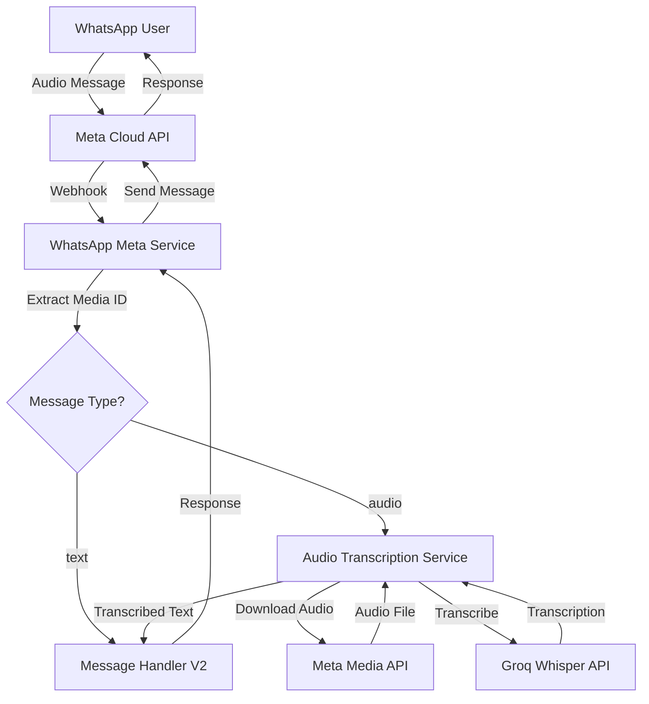

# Design Document: Audio Message Support

## Overview

Este documento descreve o design para adicionar suporte a mensagens de áudio no bot de WhatsApp da FaciliAuto. A funcionalidade permite que usuários enviem mensagens de voz que são automaticamente transcritas usando Groq Whisper e processadas como mensagens de texto normais.

A arquitetura segue o padrão existente do projeto, adicionando um novo serviço de transcrição que se integra ao fluxo de processamento de mensagens do WhatsApp.

## Architecture



### Flow Description

1. Usuário envia mensagem de áudio via WhatsApp
2. Meta Cloud API envia webhook para o serviço
3. WhatsApp Meta Service identifica o tipo de mensagem
4. Para áudio: Audio Transcription Service é acionado
5. Serviço baixa o arquivo de áudio da Meta Media API
6. Áudio é enviado para Groq Whisper para transcrição
7. Texto transcrito é passado para o Message Handler
8. Resposta é enviada de volta ao usuário

## Components and Interfaces

### 1. AudioTranscriptionService

Novo serviço responsável por gerenciar a transcrição de áudio.

```typescript
// src/services/audio-transcription.service.ts

interface TranscriptionResult {
  success: boolean;
  text?: string;
  duration?: number;
  language?: string;
  error?: string;
  errorCode?: 'DOWNLOAD_FAILED' | 'TRANSCRIPTION_FAILED' | 'DURATION_EXCEEDED' | 'LOW_QUALITY' | 'DISABLED';
}

interface AudioTranscriptionService {
  /**
   * Transcribe audio from a Meta media ID
   */
  transcribeFromMediaId(mediaId: string): Promise<TranscriptionResult>;
  
  /**
   * Check if audio transcription is enabled
   */
  isEnabled(): boolean;
  
  /**
   * Get maximum supported audio duration in seconds
   */
  getMaxDuration(): number;
}
```

### 2. WhatsAppMetaService Updates

Modificações no serviço existente para suportar mensagens de áudio.

```typescript
// Updates to src/services/whatsapp-meta.service.ts

interface MetaWebhookMessage {
  from: string;
  id: string;
  timestamp: string;
  text?: { body: string };
  audio?: {
    id: string;
    mime_type: string;
  };
  type: 'text' | 'audio' | 'image' | 'video' | 'document' | 'sticker';
}

// New method
async handleAudioMessage(message: MetaWebhookMessage): Promise<void>;

// Updated method signature
async downloadMedia(mediaId: string): Promise<Buffer>;
```

### 3. Environment Configuration

Novas variáveis de ambiente para configuração.

```typescript
// Updates to src/config/env.ts

// Audio Transcription
ENABLE_AUDIO_TRANSCRIPTION: z.string().transform(val => val === 'true').default('true'),
AUDIO_MAX_DURATION_SECONDS: z.string().transform(Number).default('120'), // 2 minutes
```

## Data Models

### TranscriptionLog (for monitoring)

```typescript
interface TranscriptionLog {
  id: string;
  conversationId: string;
  mediaId: string;
  audioMimeType: string;
  audioDurationSeconds: number;
  audioSizeBytes: number;
  transcriptionText: string;
  processingTimeMs: number;
  success: boolean;
  errorCode?: string;
  errorMessage?: string;
  createdAt: Date;
}
```

### Message Updates

O modelo de mensagem existente será atualizado para indicar origem de áudio:

```typescript
// Existing Message model update
interface Message {
  // ... existing fields
  messageType: 'text' | 'audio_transcription';
  originalMediaId?: string; // For audio messages
}
```


## Correctness Properties

*A property is a characteristic or behavior that should hold true across all valid executions of a system-essentially, a formal statement about what the system should do. Properties serve as the bridge between human-readable specifications and machine-verifiable correctness guarantees.*

### Property 1: Audio message parsing extracts media_id

*For any* valid webhook payload with message type "audio", the WhatsApp_Service SHALL correctly extract the media_id from the audio object.

**Validates: Requirements 1.1**

### Property 2: Audio transcription round-trip produces response

*For any* audio message with a valid media_id, when the feature is enabled and the audio is within duration limits, the system SHALL produce a text response equivalent to processing the transcribed text directly.

**Validates: Requirements 1.2, 1.3, 1.4, 1.5**

### Property 3: Audio message acknowledgment before processing

*For any* audio message received, the system SHALL mark the message as read and send acknowledgment before starting the transcription process.

**Validates: Requirements 2.1, 2.2**

### Property 4: Error handling produces appropriate user messages

*For any* failure during audio processing (download failure, transcription failure), the system SHALL return a user-friendly error message that suggests alternatives (retry or type).

**Validates: Requirements 3.1, 3.2**

### Property 5: Feature flag controls audio processing behavior

*For any* audio message, when ENABLE_AUDIO_TRANSCRIPTION is false, the system SHALL return a message indicating audio is not supported. When true, the system SHALL attempt transcription.

**Validates: Requirements 4.1, 4.2**

### Property 6: Audio message persistence includes metadata

*For any* successfully transcribed audio message stored in the database, the message record SHALL have messageType='audio_transcription' and include the original mediaId.

**Validates: Requirements 5.4**

### Property 7: Transcription logging completeness

*For any* audio transcription attempt (success or failure), the system SHALL log: audio duration, file size, processing time, and error details if applicable.

**Validates: Requirements 5.1, 5.2, 5.3**

## Error Handling

### Error Categories and Responses

| Error Type | Error Code | User Message |
|------------|------------|--------------|
| Download Failed | `DOWNLOAD_FAILED` | "Não consegui baixar seu áudio. Pode tentar enviar novamente ou digitar sua mensagem?" |
| Transcription Failed | `TRANSCRIPTION_FAILED` | "Não consegui entender seu áudio. Pode tentar enviar novamente com mais clareza ou digitar sua mensagem?" |
| Duration Exceeded | `DURATION_EXCEEDED` | "Seu áudio é muito longo (máximo 2 minutos). Pode enviar um áudio mais curto ou digitar sua mensagem?" |
| Low Quality | `LOW_QUALITY` | "O áudio está com qualidade baixa. Pode enviar novamente em um ambiente mais silencioso ou digitar sua mensagem?" |
| Feature Disabled | `DISABLED` | "No momento não estou conseguindo ouvir áudios. Pode digitar sua mensagem, por favor?" |

### Retry Strategy

- Download failures: Retry up to 2 times with exponential backoff (1s, 2s)
- Transcription failures: No retry (likely audio quality issue)
- API rate limits: Respect Groq rate limits, queue if necessary

### Graceful Degradation

When audio transcription fails, the system should:
1. Log the error with full context
2. Send user-friendly error message
3. Continue accepting text messages normally
4. Not affect other users' conversations

## Testing Strategy

### Dual Testing Approach

This feature requires both unit tests and property-based tests:

- **Unit tests**: Verify specific examples, edge cases, and error conditions
- **Property-based tests**: Verify universal properties that should hold across all inputs

### Property-Based Testing Framework

We will use **fast-check** as the property-based testing library for TypeScript.

Configuration:
- Minimum 100 iterations per property test
- Each property test must be tagged with: `**Feature: audio-message-support, Property {number}: {property_text}**`

### Test Categories

#### Unit Tests

1. **AudioTranscriptionService**
   - `transcribeFromMediaId` with valid media ID
   - `transcribeFromMediaId` with invalid media ID
   - `isEnabled` returns correct value based on env
   - `getMaxDuration` returns configured value

2. **WhatsAppMetaService Audio Handling**
   - `handleAudioMessage` processes audio correctly
   - `handleAudioMessage` handles disabled feature
   - `downloadMedia` returns audio buffer
   - Error message formatting

3. **Integration**
   - Full flow: audio webhook → transcription → response
   - Feature flag toggle behavior

#### Property-Based Tests

Each correctness property will have a corresponding property-based test:

1. **Property 1 Test**: Generate random valid webhook payloads with audio type, verify media_id extraction
2. **Property 2 Test**: Generate random transcription results, verify response generation
3. **Property 3 Test**: Generate random audio messages, verify acknowledgment timing
4. **Property 4 Test**: Generate random error scenarios, verify error messages contain required elements
5. **Property 5 Test**: Generate random audio messages with feature flag states, verify behavior matches flag
6. **Property 6 Test**: Generate random audio messages, verify database records have correct fields
7. **Property 7 Test**: Generate random transcription attempts, verify log entries contain required fields

### Mocking Strategy

- **Meta Cloud API**: Mock `axios` calls for media download
- **Groq Whisper API**: Mock `groq.audio.transcriptions.create`
- **Database**: Use in-memory Prisma or mock Prisma client
- **Logger**: Capture log output for verification

