# Design Document: Conversation State Fixes

## Overview

This design addresses two critical conversational flow issues in the WhatsApp vehicle sales bot:

1. **Name Correction Handling**: When users correct their name (e.g., "é Rafael na verdade" after being called "Rafaek"), the system should detect this, update the stored name, acknowledge naturally, and wait for the user's next input without proceeding to other questions.

2. **Premature Recommendation Prevention**: The bot currently jumps to vehicle recommendations after collecting budget/usage info without the user explicitly requesting them. The system should stay in discovery mode until the user makes a clear request to see vehicles.

Both fixes require modifications to the intent detection system and conversation state management in the LangGraph workflow.

## Architecture

The solution integrates with the existing LangGraph-based conversation flow:


### Component Interaction

```mermaid
sequenceDiagram
    participant U as User
    participant GN as Greeting Node
    participant DN as Discovery Node
    participant ID as Intent Detector
    participant NCD as Name Correction Detector
    participant RN as Recommendation Node
    
    Note over U,RN: Name Correction Flow
    U->>GN: "é Rafael na verdade"
    GN->>NCD: detectNameCorrection(message, profile)
    NCD-->>GN: {isCorrection: true, newName: "Rafael"}
    GN->>GN: Update profile.customerName
    GN-->>U: "Desculpa, Rafael! Como posso te ajudar?"
    
    Note over U,RN: Premature Recommendation Prevention
    U->>DN: "100000" (budget)
    DN->>ID: detectExplicitRecommendationRequest(message)
    ID-->>DN: false
    DN-->>U: "Ótimo! E pra que você vai usar o carro?"
    
    U->>DN: "dia a dia"
    DN->>ID: detectExplicitRecommendationRequest(message)
    ID-->>DN: false
    DN-->>U: "Entendi! Quer que eu te mostre algumas opções?"
    
    U->>DN: "sim, mostra"
    DN->>ID: detectExplicitRecommendationRequest(message)
    ID-->>DN: true
    DN->>RN: Transition with recommendations
```



## Components and Interfaces

### 1. Name Correction Detector

New module to be added at `src/graph/langgraph/extractors/name-correction-detector.ts`:

```typescript
interface NameCorrectionResult {
  isCorrection: boolean;
  correctedName: string | null;
  confidence: number;
}

interface NameCorrectionDetectorConfig {
  existingName: string | null;
}

/**
 * Detects if a user message is correcting their previously stored name
 */
function detectNameCorrection(
  message: string, 
  config: NameCorrectionDetectorConfig
): NameCorrectionResult;
```

**Correction Patterns to Detect:**
```typescript
const NAME_CORRECTION_PATTERNS: RegExp[] = [
  // "é [Name] na verdade" / "na verdade é [Name]"
  /(?:^|\s)(?:é|e)\s+([A-ZÀ-Úa-zà-ú]+)\s+na\s+verdade/i,
  /na\s+verdade\s+(?:é|e)\s+([A-ZÀ-Úa-zà-ú]+)/i,
  
  // "não, é [Name]" / "não, [Name]"
  /^n[ãa]o[,.]?\s*(?:é|e)?\s*([A-ZÀ-Úa-zà-ú]+)/i,
  
  // "meu nome é [Name]" (when name already exists - implies correction)
  /meu\s+nome\s+(?:é|e)\s+([A-ZÀ-Úa-zà-ú]+)/i,
  
  // "me chama de [Name]" / "pode me chamar de [Name]"
  /(?:me\s+chama|pode\s+me\s+chamar)\s+de\s+([A-ZÀ-Úa-zà-ú]+)/i,
  
  // "o nome é [Name]"
  /o\s+nome\s+(?:é|e)\s+([A-ZÀ-Úa-zà-ú]+)/i,
  
  // "na verdade me chamo [Name]"
  /na\s+verdade\s+me\s+chamo\s+([A-ZÀ-Úa-zà-ú]+)/i,
  
  // "errou, é [Name]" / "errado, é [Name]"
  /err(?:ou|ado)[,.]?\s*(?:é|e)?\s*([A-ZÀ-Úa-zà-ú]+)/i,
];
```

### 2. Explicit Recommendation Request Detector

Extension to existing intent detector at `src/agents/vehicle-expert/intent-detector.ts`:

```typescript
/**
 * Detects if user is explicitly requesting to see vehicle recommendations
 */
function detectExplicitRecommendationRequest(message: string): boolean;

/**
 * Detects if message is purely information provision (budget, usage)
 */
function isInformationProvision(message: string): boolean;
```

**Explicit Request Patterns:**
```typescript
const EXPLICIT_RECOMMENDATION_PATTERNS: RegExp[] = [
  // Direct requests
  /\b(mostra|mostrar|ver|veja)\b.*\b(carro|veículo|opç|sugest)/i,
  /\bquero\s+ver\b/i,
  /\bme\s+(indica|sugere|mostra|recomenda)/i,
  /\b(indica|sugere|recomenda)\s+(um|uma|algum)/i,
  
  // Questions about availability
  /\bo\s+que\s+(tem|vocês\s+tem|voc[êe]s?\s+tem)/i,
  /\btem\s+algum/i,
  /\bquais?\s+(opç|carro|veículo)/i,
  /\bpode\s+mostrar/i,
  
  // Affirmative to "want to see options?"
  /^(sim|pode|quero|mostra|manda|beleza|ok|claro)/i,
];

const INFORMATION_PROVISION_PATTERNS: RegExp[] = [
  // Pure budget values
  /^\d+(\s*(mil|k|reais|r\$))?$/i,
  /^(até|ate)\s*\d+/i,
  /^(entre|de)\s*\d+\s*(e|a)\s*\d+/i,
  
  // Single-word usage descriptions
  /^(trabalho|família|familia|lazer|viagem|uber|99|app|dia\s*a\s*dia)$/i,
  
  // Short descriptive answers
  /^(suv|sedan|hatch|pickup|picape)$/i,
];
```

### 3. Modified Greeting Node

Updates to `src/graph/nodes/greeting.node.ts`:

```typescript
// Add name correction handling at the start of greetingNode
export async function greetingNode(state: IGraphState): Promise<Partial<IGraphState>> {
  const lastMessage = state.messages[state.messages.length - 1];
  
  // Check for name correction FIRST if we already have a name
  if (state.profile?.customerName && lastMessage?.content) {
    const correctionResult = detectNameCorrection(
      lastMessage.content.toString(),
      { existingName: state.profile.customerName }
    );
    
    if (correctionResult.isCorrection && correctionResult.correctedName) {
      const firstName = correctionResult.correctedName.split(' ')[0];
      return {
        next: 'greeting', // Stay in current state
        profile: {
          ...state.profile,
          customerName: correctionResult.correctedName,
        },
        messages: [
          new AIMessage(
            `Desculpa, ${firstName}! 😊 Como posso te ajudar hoje?`
          ),
        ],
      };
    }
  }
  
  // ... rest of existing logic
}
```

### 4. Modified Discovery Node

Updates to `src/graph/nodes/discovery.node.ts`:

```typescript
export async function discoveryNode(state: IGraphState): Promise<Partial<IGraphState>> {
  const lastMessage = state.messages[state.messages.length - 1];
  const messageContent = lastMessage?.content?.toString() || '';
  
  // Check for name correction in discovery node too
  if (state.profile?.customerName) {
    const correctionResult = detectNameCorrection(
      messageContent,
      { existingName: state.profile.customerName }
    );
    
    if (correctionResult.isCorrection && correctionResult.correctedName) {
      const firstName = correctionResult.correctedName.split(' ')[0];
      return {
        next: 'discovery', // Stay in discovery
        profile: {
          ...state.profile,
          customerName: correctionResult.correctedName,
        },
        messages: [
          new AIMessage(
            `Desculpa pelo erro, ${firstName}! Continuando... o que você está procurando?`
          ),
        ],
      };
    }
  }
  
  // Check if this is pure information provision (not a recommendation request)
  if (isInformationProvision(messageContent)) {
    // Process the information but don't auto-trigger recommendations
    const response = await vehicleExpert.chat(messageContent, context);
    
    // Override canRecommend to false for info provision
    return {
      next: 'discovery', // Stay in discovery
      profile: {
        ...state.profile,
        ...response.extractedPreferences,
      },
      messages: response.response ? [new AIMessage(response.response)] : [],
    };
  }
  
  // Check for explicit recommendation request
  if (detectExplicitRecommendationRequest(messageContent)) {
    // Allow transition to recommendation
    const response = await vehicleExpert.chat(messageContent, context);
    return {
      next: response.canRecommend ? 'recommendation' : 'discovery',
      // ... rest of response handling
    };
  }
  
  // ... rest of existing logic with modified transition logic
}
```

## Data Models

### Extended CustomerProfile

No changes to the existing CustomerProfile structure are required. The `customerName` field already exists and will be updated in place.

### NameCorrectionResult

```typescript
interface NameCorrectionResult {
  /** Whether the message is a name correction */
  isCorrection: boolean;
  
  /** The corrected name extracted from the message */
  correctedName: string | null;
  
  /** Confidence score (0-1) of the detection */
  confidence: number;
}
```

### IntentClassification (Extended)

```typescript
type MessageIntent = 
  | 'name_correction'
  | 'information_provision'
  | 'explicit_recommendation_request'
  | 'question'
  | 'affirmative'
  | 'negative'
  | 'other';

interface IntentClassificationResult {
  intent: MessageIntent;
  confidence: number;
  extractedData?: {
    name?: string;
    budget?: number;
    usage?: string;
  };
}
```


## Correctness Properties

*A property is a characteristic or behavior that should hold true across all valid executions of a system—essentially, a formal statement about what the system should do. Properties serve as the bridge between human-readable specifications and machine-verifiable correctness guarantees.*

### Property 1: Name Correction Pattern Detection

*For any* message containing a name correction pattern (e.g., "é [Name] na verdade", "não, é [Name]") when a name already exists in the profile, the Name_Correction_Detector SHALL return `isCorrection: true` with the correct name extracted.

**Validates: Requirements 1.1, 3.1**

### Property 2: Profile Update After Name Correction

*For any* detected name correction with a valid corrected name, the resulting state SHALL have `profile.customerName` equal to the corrected name.

**Validates: Requirements 1.2**

### Property 3: Acknowledgment Response Contains Corrected Name

*For any* name correction that is detected and processed, the response message SHALL contain the corrected name (or its first name portion).

**Validates: Requirements 1.3**

### Property 4: State Preservation After Name Correction

*For any* name correction detected in any conversation state, the `next` field in the returned state SHALL equal the current state (no state transition occurs).

**Validates: Requirements 1.4, 1.5**

### Property 5: Information Provision Does Not Trigger Recommendations

*For any* message classified as information provision (budget values, usage descriptions), the Discovery_Node SHALL NOT set `next` to 'recommendation'.

**Validates: Requirements 2.1, 2.2, 4.2**

### Property 6: Explicit Recommendation Request Detection

*For any* message containing explicit recommendation request patterns (e.g., "mostra carros", "quero ver opções"), the Intent_Detector SHALL return true for `detectExplicitRecommendationRequest`.

**Validates: Requirements 2.3, 4.1**

### Property 7: Recommendation Transition Only On Explicit Request

*For any* state transition to 'recommendation' from 'discovery', there SHALL have been either an explicit recommendation request OR an affirmative response to a "want to see options?" question.

**Validates: Requirements 2.4**

### Property 8: Ask Before Showing When Profile Complete

*For any* discovery state where budget AND (usage OR bodyType) are present AND no explicit recommendation request was made, the response SHALL contain a question asking if the user wants to see options.

**Validates: Requirements 2.5**

### Property 9: Name Extraction From Correction Messages

*For any* name correction message, the extracted name SHALL match the name present in the correction pattern (accounting for capitalization normalization).

**Validates: Requirements 3.2**

### Property 10: Transcription Error Handling

*For any* name correction containing a known transcription error (from TRANSCRIPTION_FIXES), the corrected name SHALL be the fixed version, not the erroneous transcription.

**Validates: Requirements 3.4**

### Property 11: Message Intent Classification Accuracy

*For any* message, the intent classification SHALL correctly distinguish between:
- Name corrections (when name exists and correction pattern present)
- Information provision (budget/usage values)
- Explicit recommendation requests (action-requesting patterns)
- Other intents

**Validates: Requirements 4.3, 4.4**

## Error Handling

### Invalid Name Extraction

WHEN the Name_Correction_Detector identifies a correction pattern but fails to extract a valid name:
- Log warning with the original message
- Return `isCorrection: false` to avoid corrupting the profile
- Continue with normal message processing

### Empty or Whitespace Names

WHEN the extracted corrected name is empty or contains only whitespace:
- Reject the correction
- Return `isCorrection: false`
- Do not update the profile

### Same Name Correction

WHEN the corrected name matches the existing name (case-insensitive):
- Do not treat as a correction
- Return `isCorrection: false`
- Process message normally (may be user confirming their name)

### Pattern Matching Conflicts

WHEN a message matches both name correction AND recommendation request patterns:
- Prioritize name correction (it's more specific and user-initiated)
- Process name correction first
- Do not trigger recommendation flow

### Missing Profile Data

WHEN checking for name correction but `profile.customerName` is null/undefined:
- Skip name correction detection
- Process as normal name extraction (first-time name provision)

## Testing Strategy

### Unit Tests

Unit tests should cover specific examples and edge cases:

1. **Name Correction Detection**
   - Test each correction pattern individually
   - Test with various name formats (single name, compound names)
   - Test edge case: same name as stored
   - Test edge case: empty/whitespace names

2. **Recommendation Request Detection**
   - Test each explicit request pattern
   - Test budget-only messages don't trigger
   - Test usage-only messages don't trigger

3. **State Transitions**
   - Test correction doesn't change state
   - Test info provision stays in discovery
   - Test explicit request triggers recommendation

### Property-Based Tests

Property-based tests should use a library like `fast-check` to generate random inputs and verify properties hold universally.

**Configuration:**
- Minimum 100 iterations per property test
- Use `fast-check` for TypeScript property-based testing

**Test Tagging Format:**
Each property test should be tagged with:
```typescript
// Feature: conversation-state-fixes, Property N: [property description]
```

**Property Test Generators:**

1. **Name Generator**: Generate valid Brazilian names using the COMMON_BRAZILIAN_NAMES set
2. **Correction Pattern Generator**: Generate messages using NAME_CORRECTION_PATTERNS with random names
3. **Budget Generator**: Generate budget values in various formats (numeric, "X mil", "até X")
4. **Usage Generator**: Generate usage descriptions from known patterns
5. **Recommendation Request Generator**: Generate explicit request messages

**Property Tests to Implement:**

| Property | Test Description | Generator |
|----------|------------------|-----------|
| 1 | Correction patterns detected | Correction Pattern + Name |
| 2 | Profile updated correctly | Correction Pattern + Name |
| 3 | Response contains name | Correction Pattern + Name |
| 4 | State preserved | Correction Pattern + State |
| 5 | Info provision no transition | Budget/Usage Generator |
| 6 | Request patterns detected | Request Pattern Generator |
| 7 | Transition only on request | Mixed Message Generator |
| 8 | Ask before showing | Profile + Message Generator |
| 9 | Name extraction accuracy | Correction Pattern + Name |
| 10 | Transcription fixes applied | Known Error Generator |
| 11 | Intent classification | Mixed Message Generator |

### Integration Tests

Integration tests should verify the complete flow:

1. **Name Correction Flow**
   - Send greeting → Get wrong name → Send correction → Verify acknowledgment and profile update

2. **Premature Recommendation Prevention**
   - Send budget → Verify no recommendations
   - Send usage → Verify no recommendations
   - Send explicit request → Verify recommendations shown

3. **Combined Scenarios**
   - Name correction during discovery
   - Multiple info provisions before request
   - Correction after recommendations shown
