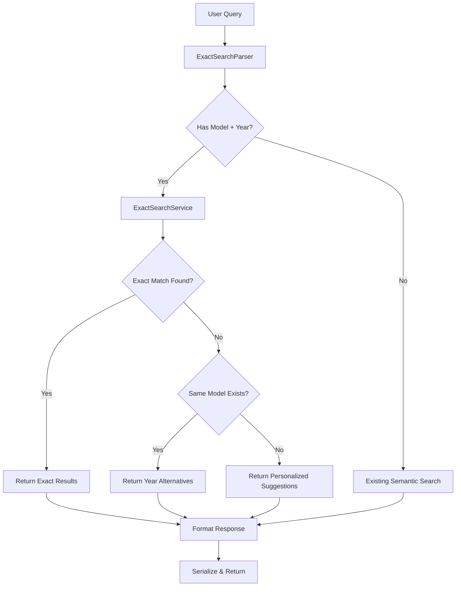

# Design Document: Exact Vehicle Search

## Overview

Esta funcionalidade aprimora o sistema de busca de veículos para lidar corretamente com buscas exatas (modelo + ano). O sistema atual usa busca semântica que pode retornar veículos similares mas não exatos. A nova implementação adiciona uma camada de extração de filtros específicos e lógica de priorização para garantir que buscas exatas retornem resultados precisos ou alternativas claras.

## Architecture



## Components and Interfaces

### 1. ExactSearchParser

Responsável por extrair modelo e ano da query do usuário.

```typescript
interface ExtractedFilters {
  model: string | null;
  year: number | null;
  yearRange: { min: number; max: number } | null;
  rawQuery: string;
}

interface ExactSearchParser {
  parse(query: string): ExtractedFilters;
}
```

**Responsabilidades:**
- Identificar nome do modelo na query
- Extrair ano (formato completo ou abreviado)
- Detectar ranges de ano ("2018 a 2020", "2019/2020")
- Normalizar variações de formato

### 2. ExactSearchService

Serviço principal que coordena a busca exata.

```typescript
interface ExactSearchResult {
  type: 'exact' | 'year_alternatives' | 'suggestions';
  vehicles: VehicleMatch[];
  message: string;
  availableYears?: number[];
  requestedModel: string;
  requestedYear: number;
}

interface ExactSearchService {
  search(filters: ExtractedFilters, inventory: Vehicle[]): ExactSearchResult;
  findExactMatches(model: string, year: number, inventory: Vehicle[]): Vehicle[];
  findYearAlternatives(model: string, requestedYear: number, inventory: Vehicle[]): Vehicle[];
  findSimilarSuggestions(model: string, year: number, inventory: Vehicle[]): VehicleMatch[];
}
```

### 3. SearchResultSerializer

Serializa e deserializa resultados de busca.

```typescript
interface SerializedSearchResult {
  type: string;
  vehicles: SerializedVehicle[];
  message: string;
  metadata: {
    requestedModel: string;
    requestedYear: number;
    availableYears?: number[];
    timestamp: string;
  };
}

interface SearchResultSerializer {
  serialize(result: ExactSearchResult): string;
  deserialize(json: string): ExactSearchResult;
}
```

## Data Models

### ExtractedFilters
```typescript
interface ExtractedFilters {
  model: string | null;        // Nome do modelo extraído (ex: "Onix")
  year: number | null;         // Ano específico (ex: 2019)
  yearRange: {                 // Range de anos (se especificado)
    min: number;
    max: number;
  } | null;
  rawQuery: string;            // Query original do usuário
}
```

### ExactSearchResult
```typescript
interface ExactSearchResult {
  type: 'exact' | 'year_alternatives' | 'suggestions';
  vehicles: VehicleMatch[];
  message: string;
  availableYears?: number[];   // Anos disponíveis do modelo (para year_alternatives)
  requestedModel: string;
  requestedYear: number;
}
```

### VehicleMatch (existente, estendido)
```typescript
interface VehicleMatch {
  vehicle: Vehicle;
  matchScore: number;          // 100 para exact, calculado para outros
  reasoning: string;
  matchType: 'exact' | 'year_alternative' | 'suggestion';
}
```

## Correctness Properties

*A property is a characteristic or behavior that should hold true across all valid executions of a system-essentially, a formal statement about what the system should do. Properties serve as the bridge between human-readable specifications and machine-verifiable correctness guarantees.*

### Property 1: Parser extracts model and year correctly from all valid formats

*For any* valid search query containing a vehicle model and year in any supported format (model-year, year-model, abbreviated year, year range, slash format), the parser SHALL extract the correct model name and year value(s).

**Validates: Requirements 1.1, 5.1, 5.2, 5.3, 5.4**

### Property 2: Exact matches are prioritized with score 100

*For any* search with extracted model and year filters, if vehicles matching both criteria exist in inventory, those vehicles SHALL appear first in results with matchScore equal to 100.

**Validates: Requirements 1.2, 1.3**

### Property 3: Multiple exact matches are ordered by price desc, mileage asc, version

*For any* set of vehicles matching the exact model and year criteria, the results SHALL be ordered by price (descending), then mileage (ascending), then version (alphabetically).

**Validates: Requirements 1.4**

### Property 4: Unavailability response contains requested model and year

*For any* search where no exact match exists, the response message SHALL contain both the requested model name and year.

**Validates: Requirements 2.1, 2.2**

### Property 5: Year alternatives are ordered by proximity to requested year

*For any* search where exact match doesn't exist but same model with different years exists, the alternatives SHALL be ordered by absolute distance from the requested year (closest first).

**Validates: Requirements 3.1, 3.2**

### Property 6: Year alternatives response includes available years list

*For any* year alternatives response, the result SHALL include a list of all available years for that model in inventory.

**Validates: Requirements 3.3, 3.4**

### Property 7: Personalized suggestions match similarity criteria

*For any* search where the requested model doesn't exist in inventory, the suggestions SHALL include vehicles with similar body type, price range (±30%), or year (±3 years) to typical vehicles of the requested model.

**Validates: Requirements 4.1, 4.2**

### Property 8: All suggestions include non-empty reasoning

*For any* suggestion returned (year alternative or personalized), the reasoning field SHALL be non-empty and explain why the vehicle is relevant.

**Validates: Requirements 4.3, 4.4**

### Property 9: Serialization round-trip preserves data integrity

*For any* ExactSearchResult, serializing then deserializing SHALL produce an equivalent object with all fields preserved.

**Validates: Requirements 6.1, 6.2, 6.3**

## Error Handling

| Scenario | Handling |
|----------|----------|
| Query sem modelo identificável | Fallback para busca semântica existente |
| Query com ano inválido (ex: "Onix 1850") | Ignorar ano, buscar apenas por modelo |
| Ano abreviado ambíguo (ex: "50") | Assumir século 21 se <= 30, senão século 20 |
| Inventory vazio | Retornar resultado vazio com mensagem apropriada |
| Erro de serialização | Log error, retornar objeto não serializado |

## Testing Strategy

### Property-Based Testing

Utilizaremos **fast-check** como biblioteca de property-based testing para TypeScript.

**Configuração:**
- Mínimo de 100 iterações por propriedade
- Cada teste deve referenciar explicitamente a propriedade do design: `**Feature: exact-vehicle-search, Property {N}: {description}**`

**Generators necessários:**
- `vehicleModelGenerator`: Gera nomes de modelos válidos (Onix, Civic, Corolla, etc.)
- `yearGenerator`: Gera anos válidos (1990-2025)
- `queryFormatGenerator`: Gera queries em diferentes formatos
- `inventoryGenerator`: Gera arrays de veículos com distribuição realista
- `exactSearchResultGenerator`: Gera resultados de busca para testes de serialização

### Unit Tests

Testes unitários para casos específicos:
- Formato de mensagem de indisponibilidade
- Edge cases de parsing (queries vazias, só números, etc.)
- Integração com serviço existente de busca
