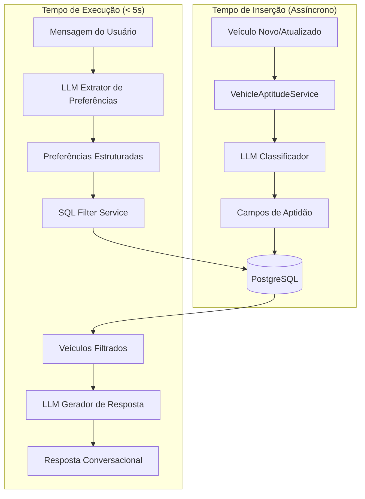

# Documento de Design

## Visão Geral

Este documento descreve a arquitetura e implementação da otimização de latência do sistema de recomendação de veículos. A solução move o processamento intensivo de LLM do tempo de execução para o tempo de inserção/atualização de veículos, permitindo que recomendações sejam geradas via filtragem SQL em menos de 5 segundos.

### Estratégia Principal

1. **Pré-cálculo**: Usar LLM para calcular campos de aptidão quando veículos são inseridos/atualizados
2. **Filtragem SQL**: Substituir ranking LLM por queries SQL usando campos pré-calculados
3. **LLM Focado**: Manter LLM apenas para extração de preferências e geração de respostas

## Arquitetura



## Componentes e Interfaces

### 1. VehicleAptitudeService

Serviço responsável por calcular e persistir campos de aptidão usando LLM.

```typescript
interface VehicleAptitudeInput {
  marca: string;
  modelo: string;
  versao: string;
  ano: number;
  km: number;
  preco: number;
  carroceria: string;
  combustivel: string;
  cambio: string;
  portas: number;
  arCondicionado: boolean;
  airbag: boolean;
  abs: boolean;
}

interface VehicleAptitudeResult {
  // Campos booleanos de aptidão
  aptoFamilia: boolean;
  aptoUberX: boolean;
  aptoUberComfort: boolean;
  aptoUberBlack: boolean;
  aptoTrabalho: boolean;
  aptoViagem: boolean;
  
  // Scores numéricos (1-10)
  scoreConforto: number;
  scoreEconomia: number;
  scoreEspaco: number;
}

class VehicleAptitudeService {
  /**
   * Calcula campos de aptidão para um veículo usando LLM
   */
  async calculateAptitude(vehicle: VehicleAptitudeInput): Promise<VehicleAptitudeResult>;
  
  /**
   * Atualiza campos de aptidão de um veículo no banco
   */
  async updateVehicleAptitude(vehicleId: string): Promise<void>;
  
  /**
   * Processa veículos em lote para migração
   */
  async migrateVehicles(batchSize: number, onProgress?: (processed: number, total: number) => void): Promise<MigrationResult>;
}
```

### 2. Prompt de Classificação LLM

O prompt deve encodar todas as regras do `RANKING_SYSTEM_PROMPT` atual:

```typescript
const CLASSIFICATION_SYSTEM_PROMPT = `Você é um especialista em classificação de veículos.

Sua tarefa é analisar um veículo e determinar sua aptidão para diferentes casos de uso.

## REGRAS DE CLASSIFICAÇÃO

### aptoFamilia (boolean)
- TRUE se: SUV médio/grande, Minivan, Sedan médio (Corolla, Civic, Versa, Cobalt, Cronos)
- TRUE se: 4+ portas, espaço traseiro amplo, porta-malas generoso
- FALSE se: Hatch compacto/subcompacto (Mobi, Kwid, Up, HB20 hatch, Gol, Argo)
- Considerar: Segurança (Isofix, Airbags), facilidade de acesso

### aptoUberX (boolean) - Regras 2026
- TRUE se: Ano >= 2016, 4 portas, ar-condicionado
- FALSE se: Pickup, Minivan, Van, Furgão
- Hatches básicos (Kwid, Uno, Mobi) = TRUE mas com ressalvas

### aptoUberComfort (boolean) - Regras 2026
- TRUE se: Ano >= 2017, Sedan médio ou SUV espaçoso
- FALSE se: Renault Kardian, Citroën Basalt, Chery Tiggo 3/3X, Renault Logan
- Regras especiais em capitais:
  - VW Virtus: somente 2026+
  - Honda City: somente 2023+
  - Nivus: somente 2023+

### aptoUberBlack (boolean) - Regras 2026
- TRUE se: Ano >= 2018, Sedan executivo ou SUV premium
- FALSE se: Mesmos modelos excluídos do Comfort
- Aparência profissional é importante

### aptoTrabalho (boolean)
- TRUE se: Durável, econômico, baixo custo de manutenção
- Pickups para carga, Sedans para representação

### aptoViagem (boolean)
- TRUE se: Confortável, econômico, porta-malas amplo
- Sedans e SUVs são ideais
- Baixa quilometragem = mais confiável

### scoreConforto (1-10)
- 9-10: SUVs premium, Sedans executivos, transmissão automática
- 7-8: SUVs médios, Sedans médios
- 5-6: Hatches médios, SUVs compactos
- 3-4: Hatches compactos
- 1-2: Hatches subcompactos, veículos básicos

### scoreEconomia (1-10)
- 9-10: Híbridos, elétricos, hatches econômicos
- 7-8: Sedans compactos, hatches médios
- 5-6: SUVs compactos, sedans médios
- 3-4: SUVs médios/grandes
- 1-2: Pickups diesel, SUVs premium

### scoreEspaco (1-10)
- 9-10: Minivans, SUVs grandes, Peruas
- 7-8: SUVs médios, Sedans grandes
- 5-6: SUVs compactos, Sedans médios
- 3-4: Hatches médios
- 1-2: Hatches compactos/subcompactos

Retorne APENAS JSON válido no formato especificado.`;
```

### 3. SQLFilterService

Serviço responsável por filtrar veículos usando campos pré-calculados.

```typescript
interface FilterCriteria {
  useCase: 'familia' | 'uberX' | 'uberComfort' | 'uberBlack' | 'trabalho' | 'viagem';
  maxPrice?: number;
  minYear?: number;
  maxKm?: number;
  bodyTypes?: string[];
  transmission?: 'Automático' | 'Manual';
}

interface FilterResult {
  vehicles: Vehicle[];
  totalCount: number;
  filterTime: number;
}

class SQLFilterService {
  /**
   * Filtra veículos usando campos pré-calculados
   */
  async filterVehicles(criteria: FilterCriteria, limit?: number): Promise<FilterResult>;
  
  /**
   * Ordena veículos por scores relevantes ao caso de uso
   */
  private buildOrderBy(useCase: string): Prisma.VehicleOrderByWithRelationInput[];
}
```

### 4. Integração com Fluxo Existente

O `VehicleRankerService` será modificado para usar filtragem SQL:

```typescript
class VehicleRankerService {
  async rank(vehicles: VehicleForRanking[], context: RankingContext): Promise<RankingResult> {
    // ANTES: Chamava LLM para ranquear todos os veículos
    // DEPOIS: Usa campos pré-calculados para filtrar e ordenar
    
    const useCase = this.mapContextToUseCase(context);
    const filtered = await this.sqlFilterService.filterVehicles({
      useCase,
      maxPrice: context.budget,
      // ... outros critérios
    });
    
    // Gera reasoning baseado nos campos pré-calculados
    return this.buildRankingResult(filtered, context);
  }
}
```

## Modelos de Dados

### Extensão do Schema Prisma

```prisma
model Vehicle {
  // ... campos existentes ...
  
  // Campos de aptidão existentes (manter compatibilidade)
  aptoUber             Boolean          @default(false)
  aptoUberBlack        Boolean          @default(false)
  aptoFamilia          Boolean          @default(true)
  aptoTrabalho         Boolean          @default(true)
  aptoViagem           Boolean          @default(false)
  
  // Novos campos de aptidão
  aptoUberX            Boolean          @default(false)
  aptoUberComfort      Boolean          @default(false)
  
  // Scores numéricos
  scoreConforto        Int?             @db.SmallInt
  scoreEconomia        Int?             @db.SmallInt
  scoreEspaco          Int?             @db.SmallInt
  
  // Metadados de classificação
  aptitudeCalculatedAt DateTime?
  aptitudeVersion      Int              @default(1)
  
  // Índices para otimização de queries
  @@index([aptoFamilia])
  @@index([aptoUberX])
  @@index([aptoUberComfort])
  @@index([aptoUberBlack])
  @@index([aptoTrabalho])
  @@index([aptoViagem])
  @@index([scoreConforto])
  @@index([scoreEconomia])
  @@index([scoreEspaco])
}
```

### Mapeamento de Casos de Uso para Filtros

| Caso de Uso | Filtro Principal | Ordenação |
|-------------|------------------|-----------|
| família | `aptoFamilia = true` | `scoreEspaco DESC, scoreConforto DESC` |
| uberX | `aptoUberX = true` | `ano DESC, km ASC` |
| uberComfort | `aptoUberComfort = true` | `ano DESC, scoreConforto DESC` |
| uberBlack | `aptoUberBlack = true` | `ano DESC, scoreConforto DESC` |
| trabalho | `aptoTrabalho = true` | `scoreEconomia DESC, preco ASC` |
| viagem | `aptoViagem = true` | `scoreConforto DESC, scoreEconomia DESC` |


## Propriedades de Corretude

*Uma propriedade é uma característica ou comportamento que deve ser verdadeiro em todas as execuções válidas de um sistema - essencialmente, uma declaração formal sobre o que o sistema deve fazer. Propriedades servem como ponte entre especificações legíveis por humanos e garantias de corretude verificáveis por máquina.*

### Property 1: Persistência de Aptidão

*Para qualquer* veículo inserido ou atualizado no banco de dados, todos os campos de aptidão (aptoFamilia, aptoUberX, aptoUberComfort, aptoUberBlack, aptoTrabalho, aptoViagem, scoreConforto, scoreEconomia, scoreEspaco) devem ser calculados e persistidos com valores não-nulos.

**Validates: Requirements 1.1, 1.2**

### Property 2: Scores no Range Válido

*Para qualquer* veículo com campos de aptidão calculados, os scores numéricos (scoreConforto, scoreEconomia, scoreEspaco) devem estar no range 1-10 inclusive.

**Validates: Requirements 1.9, 1.10, 1.11**

### Property 3: Resposta JSON Válida

*Para qualquer* veículo de entrada válido, o serviço de classificação LLM deve retornar uma resposta JSON válida contendo todos os campos esperados (6 booleanos + 3 inteiros).

**Validates: Requirements 2.5**

### Property 4: Filtragem por Aptidão

*Para qualquer* caso de uso e conjunto de veículos no banco, a filtragem SQL deve retornar apenas veículos onde o campo de aptidão correspondente é `true`.

**Validates: Requirements 3.1, 3.2, 3.3, 3.4, 3.5**

### Property 5: Ordenação por Scores

*Para qualquer* resultado de filtragem, os veículos devem estar ordenados de forma decrescente pelos scores relevantes ao caso de uso (ex: família → scoreEspaco DESC, scoreConforto DESC).

**Validates: Requirements 3.2, 3.4, 3.5**

### Property 6: Completude da Migração

*Para qualquer* execução completa do script de migração, todos os veículos existentes no banco devem ter campos de aptidão preenchidos (aptitudeCalculatedAt não-nulo).

**Validates: Requirements 5.1, 5.4**

### Property 7: Regras UberX

*Para qualquer* veículo com ano < 2016, ou portas < 4, ou arCondicionado = false, o campo aptoUberX deve ser `false`.

**Validates: Requirements 1.4**

### Property 8: Regras UberComfort - Modelos Excluídos

*Para qualquer* veículo dos modelos excluídos (Kardian, Basalt, Tiggo 3/3X, Logan), o campo aptoUberComfort deve ser `false` independente de outras características.

**Validates: Requirements 1.5**

## Tratamento de Erros

### Erros de Classificação LLM

| Cenário | Tratamento |
|---------|------------|
| LLM timeout | Retry com backoff exponencial (3 tentativas) |
| Resposta JSON inválida | Log erro, usar classificação heurística como fallback |
| Rate limit | Aguardar e retry, processar em lotes menores |
| Campos faltando na resposta | Usar valores default conservadores |

### Erros de Migração

| Cenário | Tratamento |
|---------|------------|
| Falha em veículo específico | Log erro, continuar com próximo, marcar para reprocessamento |
| Interrupção do script | Salvar checkpoint, permitir retomada |
| Inconsistência de dados | Validação final com relatório de erros |

### Fallback de Classificação

Quando o LLM falha, usar classificação heurística baseada em regras:

```typescript
function fallbackClassification(vehicle: VehicleAptitudeInput): VehicleAptitudeResult {
  const carroceria = vehicle.carroceria.toLowerCase();
  const isSUV = carroceria.includes('suv');
  const isSedan = carroceria.includes('sedan');
  const isHatch = carroceria.includes('hatch');
  
  return {
    aptoFamilia: (isSUV || isSedan) && vehicle.portas >= 4,
    aptoUberX: vehicle.ano >= 2016 && vehicle.portas >= 4 && vehicle.arCondicionado,
    aptoUberComfort: vehicle.ano >= 2017 && (isSUV || isSedan),
    aptoUberBlack: vehicle.ano >= 2018 && (isSUV || isSedan),
    aptoTrabalho: true,
    aptoViagem: (isSUV || isSedan) && vehicle.km < 100000,
    scoreConforto: isSUV ? 7 : isSedan ? 6 : 4,
    scoreEconomia: isHatch ? 7 : isSedan ? 6 : 4,
    scoreEspaco: isSUV ? 8 : isSedan ? 6 : 4,
  };
}
```

## Estratégia de Testes

### Testes Unitários

1. **VehicleAptitudeService**
   - Teste de parsing de resposta JSON do LLM
   - Teste de fallback quando LLM falha
   - Teste de validação de scores no range 1-10

2. **SQLFilterService**
   - Teste de filtragem por cada caso de uso
   - Teste de ordenação por scores
   - Teste de combinação de filtros (preço, ano, km)

3. **Migração**
   - Teste de processamento em lotes
   - Teste de retomada após falha
   - Teste de validação final

### Testes de Propriedade (Property-Based Testing)

Usar biblioteca `fast-check` para TypeScript com mínimo de 100 iterações por teste.

1. **Property 1: Persistência de Aptidão**
   - Gerar veículos aleatórios, inserir, verificar campos preenchidos
   - Tag: `Feature: latency-optimization, Property 1: Persistência de Aptidão`

2. **Property 2: Scores no Range Válido**
   - Gerar veículos aleatórios, calcular aptidão, verificar range 1-10
   - Tag: `Feature: latency-optimization, Property 2: Scores no Range Válido`

3. **Property 4: Filtragem por Aptidão**
   - Gerar banco com veículos aleatórios, filtrar, verificar aptidão
   - Tag: `Feature: latency-optimization, Property 4: Filtragem por Aptidão`

4. **Property 5: Ordenação por Scores**
   - Gerar veículos com scores aleatórios, filtrar, verificar ordenação
   - Tag: `Feature: latency-optimization, Property 5: Ordenação por Scores`

5. **Property 7: Regras UberX**
   - Gerar veículos com características aleatórias, verificar regra UberX
   - Tag: `Feature: latency-optimization, Property 7: Regras UberX`

6. **Property 8: Regras UberComfort - Modelos Excluídos**
   - Gerar veículos com modelos excluídos, verificar aptoUberComfort = false
   - Tag: `Feature: latency-optimization, Property 8: Regras UberComfort - Modelos Excluídos`

### Testes de Integração

1. **Fluxo completo de inserção**
   - Inserir veículo via API → verificar campos de aptidão no banco

2. **Fluxo completo de recomendação**
   - Enviar mensagem → extrair preferências → filtrar → gerar resposta
   - Verificar latência < 5 segundos

3. **Migração end-to-end**
   - Popular banco com veículos sem aptidão → executar migração → verificar completude
