# Design Document: Vehicle Fallback Recommendations

## Overview

This design describes an intelligent fallback system for the WhatsApp vehicle sales bot that provides relevant alternative recommendations when a user's exact vehicle request cannot be fulfilled. The system implements a tiered fallback strategy that prioritizes year variations of the same model, then progressively expands to similar vehicles based on brand, category, and price range.

The fallback service integrates with the existing `ExactSearchService` and `VehicleSearchAdapter` to provide a seamless user experience. When no exact match is found, the system automatically applies fallback strategies in priority order and returns results with clear explanations of why each alternative is relevant.

## Architecture

```mermaid
flowchart TD
    A[User Request] --> B[VehicleSearchAdapter]
    B --> C[ExactSearchService]
    C --> D{Exact Match Found?}
    D -->|Yes| E[Return Exact Results]
    D -->|No| F[FallbackService]
    
    F --> G[Year Alternatives Strategy]
    G --> H{Found?}
    H -->|Yes| I[Return Year Alternatives]
    H -->|No| J[Same Brand Strategy]
    
    J --> K{Found?}
    K -->|Yes| L[Return Brand Alternatives]
    K -->|No| M[Same Category Strategy]
    
    M --> N{Found?}
    N -->|Yes| O[Return Category Alternatives]
    N -->|No| P[Price Range Strategy]
    
    P --> Q{Found?}
    Q -->|Yes| R[Return Price Alternatives]
    Q -->|No| S[Return No Results Message]
    
    I --> T[FallbackResponseFormatter]
    L --> T
    O --> T
    R --> T
    S --> T
    
    T --> U[WhatsApp Response]
```



## Components and Interfaces

### FallbackService

The core service responsible for finding alternative vehicles when exact matches are unavailable.

```typescript
interface FallbackConfig {
  maxResults: number;           // Maximum alternatives to return (default: 5)
  priceTolerancePercent: number; // Price range tolerance (default: 20)
  maxYearDistance: number;      // Maximum year difference to consider (default: 5)
}

interface FallbackResult {
  type: FallbackType;
  vehicles: FallbackVehicleMatch[];
  message: string;
  requestedModel: string;
  requestedYear: number | null;
  availableYears?: number[];
  metadata: FallbackMetadata;
}

type FallbackType = 
  | 'year_alternative'
  | 'same_brand'
  | 'same_category'
  | 'price_range'
  | 'no_results';

interface FallbackVehicleMatch {
  vehicle: Vehicle;
  similarityScore: number;
  matchingCriteria: MatchingCriterion[];
  reasoning: string;
}

interface MatchingCriterion {
  criterion: 'year' | 'brand' | 'category' | 'price' | 'transmission' | 'fuel';
  matched: boolean;
  details: string;
}

interface FallbackMetadata {
  strategyUsed: FallbackType;
  totalCandidates: number;
  processingTimeMs: number;
}

class FallbackService {
  constructor(config?: Partial<FallbackConfig>);
  
  findAlternatives(
    requestedModel: string,
    requestedYear: number | null,
    inventory: Vehicle[],
    referencePrice?: number
  ): FallbackResult;
  
  private findYearAlternatives(
    model: string,
    year: number,
    inventory: Vehicle[]
  ): FallbackVehicleMatch[];
  
  private findSameBrandAlternatives(
    model: string,
    brand: string,
    inventory: Vehicle[],
    referencePrice: number
  ): FallbackVehicleMatch[];
  
  private findSameCategoryAlternatives(
    category: string,
    inventory: Vehicle[],
    referencePrice: number
  ): FallbackVehicleMatch[];
  
  private findPriceRangeAlternatives(
    inventory: Vehicle[],
    referencePrice: number
  ): FallbackVehicleMatch[];
  
  private calculateSimilarityScore(
    vehicle: Vehicle,
    criteria: SimilarityCriteria
  ): number;
}
```

### FallbackResponseFormatter

Formats fallback results into user-friendly Portuguese messages for WhatsApp.

```typescript
interface FormattedFallbackResponse {
  acknowledgment: string;
  alternatives: FormattedAlternative[];
  summary: string;
}

interface FormattedAlternative {
  vehicleDescription: string;
  relevanceExplanation: string;
  highlights: string[];
}

class FallbackResponseFormatter {
  format(result: FallbackResult): FormattedFallbackResponse;
  
  private formatAcknowledgment(
    model: string,
    year: number | null,
    fallbackType: FallbackType
  ): string;
  
  private formatAlternative(
    match: FallbackVehicleMatch,
    fallbackType: FallbackType
  ): FormattedAlternative;
  
  private generateRelevanceExplanation(
    criteria: MatchingCriterion[]
  ): string;
}
```

### SimilarityCalculator

Calculates similarity scores between vehicles based on multiple criteria.

```typescript
interface SimilarityCriteria {
  targetCategory: string;
  targetBrand?: string;
  targetPrice: number;
  targetYear?: number;
  targetTransmission?: string;
  targetFuel?: string;
}

interface SimilarityWeights {
  category: number;    // Weight for category match (default: 40)
  brand: number;       // Weight for brand match (default: 25)
  price: number;       // Weight for price proximity (default: 20)
  features: number;    // Weight for feature matches (default: 15)
}

class SimilarityCalculator {
  constructor(weights?: Partial<SimilarityWeights>);
  
  calculate(
    vehicle: Vehicle,
    criteria: SimilarityCriteria
  ): { score: number; matchingCriteria: MatchingCriterion[] };
  
  private calculateCategoryScore(
    vehicleCategory: string,
    targetCategory: string
  ): number;
  
  private calculatePriceProximityScore(
    vehiclePrice: number,
    targetPrice: number,
    tolerancePercent: number
  ): number;
  
  private calculateFeatureScore(
    vehicle: Vehicle,
    criteria: SimilarityCriteria
  ): number;
}
```

## Data Models

### Vehicle Profile Mapping

Maps vehicle models to their typical characteristics for similarity matching.

```typescript
interface VehicleProfile {
  model: string;
  category: 'sedan' | 'suv' | 'hatch' | 'pickup' | 'minivan';
  segment: 'entry' | 'compact' | 'midsize' | 'fullsize' | 'premium';
  typicalPriceRange: { min: number; max: number };
}

const VEHICLE_PROFILES: Record<string, VehicleProfile> = {
  // Sedans
  civic: { model: 'civic', category: 'sedan', segment: 'midsize', typicalPriceRange: { min: 100000, max: 180000 } },
  corolla: { model: 'corolla', category: 'sedan', segment: 'midsize', typicalPriceRange: { min: 110000, max: 190000 } },
  cruze: { model: 'cruze', category: 'sedan', segment: 'midsize', typicalPriceRange: { min: 90000, max: 150000 } },
  virtus: { model: 'virtus', category: 'sedan', segment: 'compact', typicalPriceRange: { min: 80000, max: 130000 } },
  
  // SUVs
  compass: { model: 'compass', category: 'suv', segment: 'midsize', typicalPriceRange: { min: 140000, max: 220000 } },
  creta: { model: 'creta', category: 'suv', segment: 'compact', typicalPriceRange: { min: 100000, max: 160000 } },
  tracker: { model: 'tracker', category: 'suv', segment: 'compact', typicalPriceRange: { min: 100000, max: 150000 } },
  tcross: { model: 'tcross', category: 'suv', segment: 'compact', typicalPriceRange: { min: 110000, max: 160000 } },
  
  // Hatches
  onix: { model: 'onix', category: 'hatch', segment: 'compact', typicalPriceRange: { min: 70000, max: 100000 } },
  hb20: { model: 'hb20', category: 'hatch', segment: 'compact', typicalPriceRange: { min: 70000, max: 100000 } },
  polo: { model: 'polo', category: 'hatch', segment: 'compact', typicalPriceRange: { min: 75000, max: 110000 } },
  
  // Pickups
  hilux: { model: 'hilux', category: 'pickup', segment: 'fullsize', typicalPriceRange: { min: 180000, max: 300000 } },
  s10: { model: 's10', category: 'pickup', segment: 'fullsize', typicalPriceRange: { min: 160000, max: 280000 } },
  ranger: { model: 'ranger', category: 'pickup', segment: 'fullsize', typicalPriceRange: { min: 170000, max: 290000 } },
  strada: { model: 'strada', category: 'pickup', segment: 'compact', typicalPriceRange: { min: 80000, max: 130000 } },
  toro: { model: 'toro', category: 'pickup', segment: 'midsize', typicalPriceRange: { min: 120000, max: 180000 } },
};
```

### Category Mapping

Maps body type variations to normalized categories.

```typescript
const CATEGORY_MAPPING: Record<string, string> = {
  // Sedan variations
  'sedan': 'sedan',
  'sedã': 'sedan',
  'seda': 'sedan',
  'fastback': 'sedan',
  
  // SUV variations
  'suv': 'suv',
  'utilitario': 'suv',
  'utilitário': 'suv',
  'crossover': 'suv',
  'jipe': 'suv',
  'jeep': 'suv',
  
  // Hatch variations
  'hatch': 'hatch',
  'hatchback': 'hatch',
  'compacto': 'hatch',
  
  // Pickup variations
  'pickup': 'pickup',
  'picape': 'pickup',
  'pick-up': 'pickup',
  'caminhonete': 'pickup',
  'cabine': 'pickup',
};

function normalizeCategory(bodyType: string): string {
  const normalized = bodyType.toLowerCase().trim();
  return CATEGORY_MAPPING[normalized] || normalized;
}
```

### Fallback Priority Configuration

```typescript
interface FallbackPriority {
  order: number;
  type: FallbackType;
  minScore: number;
  maxResults: number;
}

const FALLBACK_PRIORITIES: FallbackPriority[] = [
  { order: 1, type: 'year_alternative', minScore: 70, maxResults: 5 },
  { order: 2, type: 'same_brand', minScore: 60, maxResults: 5 },
  { order: 3, type: 'same_category', minScore: 50, maxResults: 5 },
  { order: 4, type: 'price_range', minScore: 40, maxResults: 5 },
];
```


## Correctness Properties

*A property is a characteristic or behavior that should hold true across all valid executions of a system—essentially, a formal statement about what the system should do. Properties serve as the bridge between human-readable specifications and machine-verifiable correctness guarantees.*

### Property 1: Year Proximity Scoring

*For any* two vehicles of the same model with different years, when calculating year proximity scores relative to a requested year, the vehicle with a year closer to the requested year SHALL have a higher or equal score than the vehicle with a year further away.

**Validates: Requirements 1.3**

### Property 2: Year Alternatives Sorting

*For any* list of year alternative vehicles returned by the Fallback_Service, the list SHALL be sorted primarily by year proximity to the requested year (closest first), and secondarily by price descending then mileage ascending for vehicles of the same year.

**Validates: Requirements 1.2, 1.4**

### Property 3: Maximum Results Invariant

*For any* fallback operation, the number of vehicles returned SHALL never exceed the configured maximum (default 5).

**Validates: Requirements 1.5**

### Property 4: Similar Profile Filtering

*For any* similar profile search result, all returned vehicles SHALL have the same normalized category as the requested model AND have a price within ±20% of the reference price.

**Validates: Requirements 2.2, 2.3**

### Property 5: Brand Priority in Similar Profiles

*For any* similar profile search where same-brand vehicles exist in the inventory, the same-brand vehicles SHALL appear before other-brand vehicles in the results (when similarity scores are equal).

**Validates: Requirements 2.4**

### Property 6: Similarity Score Monotonicity

*For any* two vehicles being compared for similarity, the vehicle with more matching criteria (category, brand, price range, transmission, fuel) SHALL have a higher or equal similarity score.

**Validates: Requirements 2.5, 2.6**

### Property 7: Similarity Score Sorting

*For any* list of similar profile vehicles returned by the Fallback_Service, the list SHALL be sorted by similarity score in descending order.

**Validates: Requirements 2.7**

### Property 8: Fallback Priority Chain

*For any* fallback operation, the Fallback_Service SHALL return results from the highest priority strategy that produces matches: year_alternative > same_brand > same_category > price_range. If year alternatives exist, the result type SHALL be 'year_alternative' regardless of whether other strategies would also produce results.

**Validates: Requirements 4.1, 4.2, 4.3, 4.4, 4.5**

### Property 9: Response Structure Completeness

*For any* fallback result with vehicles, the response SHALL include: (1) an acknowledgment message indicating the exact vehicle is unavailable, (2) a non-empty reasoning string for each vehicle, and (3) metadata indicating the fallback type used.

**Validates: Requirements 3.1, 3.2, 5.3**

### Property 10: Year Alternatives Include Available Years

*For any* year alternative fallback result, the response SHALL include a list of all available years for the requested model in the inventory.

**Validates: Requirements 3.3**

### Property 11: Maximum Reasons Per Vehicle

*For any* formatted fallback response, each vehicle's relevance explanation SHALL contain at most 3 key reasons.

**Validates: Requirements 3.6**

### Property 12: Automatic Fallback Invocation

*For any* exact search that returns no results for a valid model/year request, the Vehicle_Search_Adapter SHALL invoke the Fallback_Service and return its results.

**Validates: Requirements 5.1**

## Error Handling

### Invalid Input Handling

| Error Condition | Handling Strategy |
|----------------|-------------------|
| Empty model name | Return empty result with message "Modelo não especificado" |
| Invalid year (negative or future) | Treat as no year specified, search all years |
| Empty inventory | Return empty result with message "Nenhum veículo disponível no momento" |
| Unknown model (not in profile mapping) | Use default category 'hatch' and estimate price from similar models |

### Fallback Chain Failures

```typescript
interface FallbackError {
  strategy: FallbackType;
  error: string;
  recoverable: boolean;
}

// If a strategy fails, log the error and continue to the next strategy
function handleStrategyError(error: FallbackError): void {
  logger.warn({ 
    strategy: error.strategy, 
    error: error.error 
  }, 'Fallback strategy failed, trying next');
  
  if (!error.recoverable) {
    throw new Error(`Unrecoverable fallback error: ${error.error}`);
  }
}
```

### Edge Cases

1. **Model exists but all vehicles are unavailable**: Return empty result with message explaining the model exists but no units are currently available.

2. **Price estimation fails**: Use a default mid-range price (R$ 100,000) as the reference for price-based fallbacks.

3. **Category normalization fails**: Default to the original body type string for matching.

4. **All strategies return empty**: Return a graceful "no alternatives found" response with suggestion to contact sales team.

## Testing Strategy

### Dual Testing Approach

This feature requires both unit tests and property-based tests for comprehensive coverage:

- **Unit tests**: Verify specific examples, edge cases, and error conditions
- **Property tests**: Verify universal properties across all valid inputs using randomized testing

### Property-Based Testing Configuration

- **Library**: fast-check (TypeScript property-based testing library)
- **Minimum iterations**: 100 per property test
- **Tag format**: `Feature: vehicle-fallback-recommendations, Property {number}: {property_text}`

### Test Categories

#### Unit Tests
- Specific model/year combinations with known inventory
- Edge cases: empty inventory, unknown models, invalid years
- Error handling scenarios
- Response formatting verification

#### Property Tests
- Year proximity scoring correctness
- Sorting invariants (year proximity, similarity score)
- Maximum results constraints
- Filtering criteria (category, price range)
- Fallback priority chain
- Response structure completeness

### Test Data Generation

```typescript
// Arbitrary generators for property tests
const vehicleArbitrary = fc.record({
  id: fc.uuid(),
  marca: fc.constantFrom('Honda', 'Toyota', 'Chevrolet', 'Volkswagen', 'Fiat'),
  modelo: fc.constantFrom('Civic', 'Corolla', 'Onix', 'Polo', 'Argo'),
  ano: fc.integer({ min: 2015, max: 2025 }),
  km: fc.integer({ min: 0, max: 200000 }),
  preco: fc.integer({ min: 50000, max: 300000 }),
  carroceria: fc.constantFrom('Sedan', 'Hatch', 'SUV', 'Pickup'),
  cambio: fc.constantFrom('Manual', 'Automático'),
  combustivel: fc.constantFrom('Flex', 'Gasolina', 'Diesel'),
  disponivel: fc.constant(true),
});

const inventoryArbitrary = fc.array(vehicleArbitrary, { minLength: 1, maxLength: 50 });
```

### Integration Tests
- VehicleSearchAdapter integration with FallbackService
- RecommendationAgent formatting of fallback results
- End-to-end flow from user request to WhatsApp response
