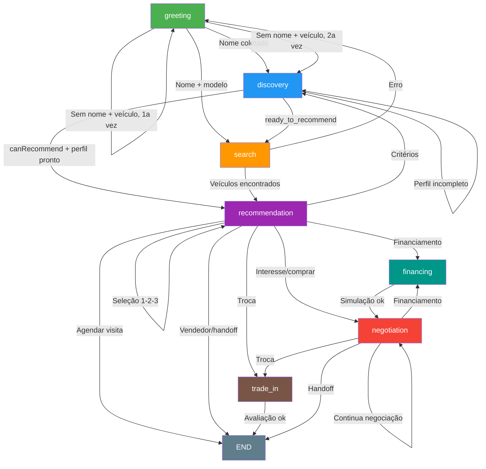

# Diagrama de Estados do Fluxo Conversacional

## Estados (Nós)

## Transições Condicionais

| De | Para | Condição |
|----|------|----------|
| greeting | discovery | `profile.customerName` definido |
| greeting | search | `customerName` + modelo específico + `canRecommend` |
| greeting | greeting | `!customerName && model && !asked_name_once` |
| greeting | discovery | `!customerName && model && asked_name_once` (quebra loop) |
| discovery | recommendation | `canRecommend && hasRecommendations && hasRecommendationReadyProfile` |
| discovery | search | `nextMode === 'ready_to_recommend'` |
| discovery | discovery | Perfil incompleto, continua coletando |
| recommendation | financing | `/financ\|parcel\|entrada\|prestação/i` |
| recommendation | trade_in | `/troca\|meu carro\|tenho um/i` |
| recommendation | negotiation | `/gostei\|quero esse\|vou levar/i` |
| recommendation | discovery | Pergunta sobre critérios |
| recommendation | recommendation | Rejeição (busca substituição) |
| recommendation | recommendation | Seleção por número (1, 2, 3) |
| *any* | END | `loopCount >= 8` (circuit breaker do router) |
| *any* | END | `errorCount >= 5` (circuit breaker de erro) |

## Flags de Estado

| Flag | Propósito | Onde é definida |
|------|-----------|-----------------|
| `asked_name_once` | Evita loop infinito no greeting quando usuário não dá nome | greeting.node |
| `handoff_requested` | Marca que usuário pediu vendedor humano | discovery, recommendation, negotiation |
| `visit_requested` | Marca que usuário quer agendar visita | recommendation (schedule handler) |
| `viewed_vehicle_{id}` | Rastreia veículos visualizados em detalhe | recommendation (selection handler) |
| `tradeInProcessed` | Marca que trade-in já foi processado | trade-in.node |

## Circuit Breakers

### 1. Router-level (workflow.ts)
- **Trigger:** Mesmo nó executado 8+ vezes consecutivas sem progresso
- **Ação:** Redireciona para `END`
- **Detecção:** `metadata.lastLoopNode === nextNode && metadata.loopCount >= 8`

### 2. Error circuit breaker (workflow.ts)
- **Trigger:** `metadata.errorCount >= 5`
- **Ação:** Redireciona para `END`

### 3. Node-level (utils/circuit-breaker.ts)
- **Config padrão:** `maxLoops: 5`, `maxErrors: 3`
- **Uso:** Pode ser chamado no início de qualquer node para proteção adicional

## Handlers de Recomendação (por prioridade)

| Prioridade | Handler | Padrão de detecção |
|------------|---------|-------------------|
| 100 | schedule | `agendar`, `visita`, `test drive` |
| 90 | handoff | `vendedor`, `humano`, `atendente`, `consultor`, `pessoa real` |
| 80 | financing | `financ*`, `parcel*`, `entrada`, `prestação` |
| 75 | trade-in | `troca`, `meu carro`, `tenho um`, `dar na troca` |
| 70 | rejection | `não gostei`, `não quero`, `mostra outro` |
| 60 | interest | `gostei`, `quero esse`, `vou levar`, `comprar` |
| 50 | selection | `1`, `2`, `3` (seleção numérica) |
| 40 | criteria | `critério`, `preferência`, `que você sabe` |

## Utilitários Compartilhados

| Utilitário | Arquivo | Função |
|-----------|---------|--------|
| State Flags | `src/utils/state-flags.ts` | `hasFlag`, `addFlag`, `removeFlag`, `addFlagIf` |
| Handoff Detector | `src/utils/handoff-detector.ts` | `detectHandoffRequest`, `addHandoffFlag` |
| Message Mapper | `src/utils/message-mapper.ts` | `mapMessagesToContext`, `countUserMessages` |
| Circuit Breaker | `src/utils/circuit-breaker.ts` | `checkCircuitBreaker`, `computeLoopCount` |
