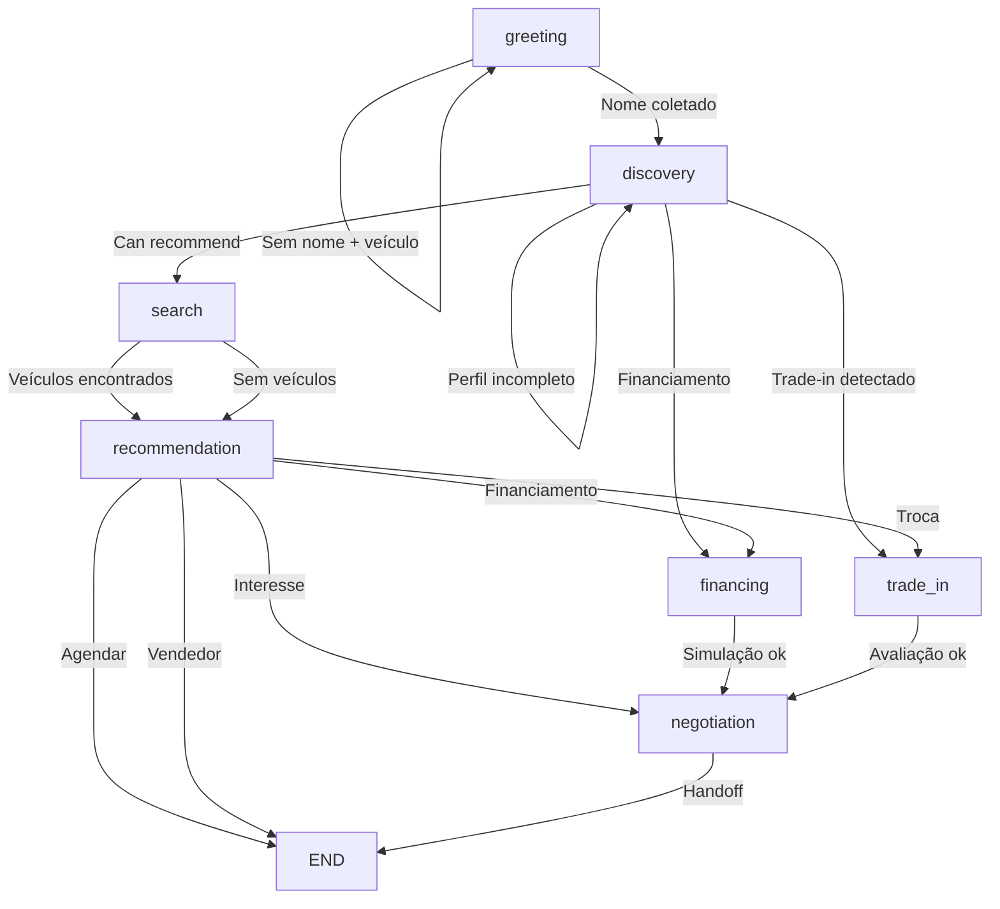

# 📋 Plano Detalhado de Correção - Fluxo Conversacional CarInsight

## 🎯 Visão Geral

| Fase | Escopo | Prazo Estimado |
|------|--------|----------------|
| **Fase 1: Correções Críticas** | Bugs P0 (loops, crashes) | 2-3 dias |
| **Fase 2: Consolidação** | Eliminar duplicações | 3-5 dias |
| **Fase 3: Refatoração** | SRP, handlers, testes | 1-2 semanas |

---

## 🔴 FASE 1: Correções Críticas (P0) - 2-3 dias

### 1.1 Fix Loop Infinito em greeting.node.ts (Scenario D)

**Problema:** Loop quando usuário envia só modelo sem nome
**Severidade:** 🔴 CRÍTICO
**Arquivo:** `src/graph/nodes/greeting.node.ts`

```typescript
// LINHA 217-235 - SUBSTITUIR POR:

// SCENARIO D: Only Vehicle (No name)
if (earlyProfileUpdate.model && !state.profile?.customerName) {
  const alreadyAsked = state.metadata.flags?.includes('asked_name_once');
  const carText = earlyProfileUpdate.minYear
    ? `${earlyProfileUpdate.model} ${earlyProfileUpdate.minYear}`
    : earlyProfileUpdate.model;

  // Segunda tentativa: prosseguir sem nome
  if (alreadyAsked) {
    logger.info({ model: earlyProfileUpdate.model }, 'GreetingNode: Second attempt without name, proceeding to discovery');
    
    return {
      next: 'discovery',
      profile: {
        ...state.profile,
        ...earlyProfileUpdate,
      },
      messages: [
        new AIMessage(
          `Tudo bem! Vamos encontrar seu *${carText}*. 😊\n\nMe conta mais sobre o que você precisa? (Orçamento, ano, uso...)`
        ),
      ],
    };
  }

  // Primeira tentativa: pedir nome
  logger.info({ model: earlyProfileUpdate.model }, 'GreetingNode: First attempt, asking for name');
  
  return {
    next: 'greeting',
    profile: {
      ...state.profile,
      ...earlyProfileUpdate,
    },
    metadata: {
      ...state.metadata,
      flags: state.metadata.flags?.includes('asked_name_once')
        ? state.metadata.flags
        : [...(state.metadata.flags || []), 'asked_name_once'],
    },
    messages: [
      new AIMessage(
        `👋 Olá! Sou a assistente virtual do *CarInsight*.\n\n🤖 *Importante:* Sou uma inteligência artificial e posso cometer erros. Para informações mais precisas, posso transferir você para nossa equipe humana.\n\nVi que você busca um *${carText}*. Ótima escolha! 🚗\n\nQual é o seu nome?`
      ),
    ],
  };
}
```

**Teste Unitário:** `tests/unit/graph/greeting-node-loop.test.ts`
```typescript
it('should not loop infinitely when user sends only vehicle model', async () => {
  const state = createInitialState();
  state.messages = [new HumanMessage('quero um Corolla')];
  
  // Primeira chamada
  const result1 = await greetingNode(state);
  expect(result1.next).toBe('greeting');
  expect(result1.metadata?.flags).toContain('asked_name_once');
  
  // Segunda chamada (simula usuário não respondendo com nome)
  state.profile = { ...state.profile, ...(result1.profile as any) };
  state.metadata = result1.metadata as any;
  const result2 = await greetingNode(state);
  expect(result2.next).toBe('discovery'); // NÃO deve ser 'greeting'
});
```

---

### 1.2 Fix Condição de Corrida em discovery.node.ts

**Problema:** Fluxo fica preso em discovery quando canRecommend=true mas hasCompletedProfile=false
**Severidade:** 🔴 CRÍTICO
**Arquivo:** `src/graph/nodes/discovery.node.ts:142-181`

```typescript
// SUBSTITUIR LINHAS 142-181 POR:

// 6. Determine Next Node with recommendation control
let next = 'discovery';
const responseMessage = response.response;

// Check if profile is complete (has budget AND usage/bodyType)
const hasCompletedProfile =
  updatedProfile.budget && (updatedProfile.usage || updatedProfile.bodyType);

// Check if we have valid recommendations
const hasRecommendations = response.canRecommend && 
  response.recommendations && 
  response.recommendations.length > 0;

if (isInfoProvision) {
  // Pure information provision - auto-transition when we have recommendations
  // FIXED: Prioritize canRecommend over hasCompletedProfile
  if (hasRecommendations) {
    next = 'recommendation';
    logger.info(
      { hasCompletedProfile, recommendationsCount: response.recommendations?.length },
      'DiscoveryNode: Has recommendations, transitioning to recommendation'
    );
  } else {
    next = 'discovery';
  }
} else if (isExplicitRequest) {
  // Explicit recommendation request
  if (hasRecommendations) {
    next = 'recommendation';
  } else if (response.nextMode) {
    next = response.nextMode;
  }
} else if (response.nextMode) {
  next = response.nextMode;
}

// Safety check: if expert says recommendation but no recommendations, stay in discovery
if (next === 'recommendation' && !hasRecommendations && !state.recommendations?.length) {
  logger.warn('DiscoveryNode: Attempted transition to recommendation without recommendations');
  next = 'discovery';
}
```

**Teste Unitário:** `tests/unit/graph/discovery-recommendation-edge-case.test.ts`
```typescript
it('should transition to recommendation when canRecommend=true even without complete profile', async () => {
  const state = createInitialState();
  state.messages = [new HumanMessage('quero um SUV até 80 mil')];
  state.profile = { customerName: 'João' }; // Perfil incompleto (sem usage)
  
  // Mock vehicleExpert para retornar canRecommend=true
  vi.mocked(vehicleExpert.chat).mockResolvedValue({
    canRecommend: true,
    recommendations: [{ vehicleId: 'v1', matchScore: 90 }],
    response: 'Encontrei opções!',
    nextMode: null,
  });
  
  const result = await discoveryNode(state);
  expect(result.next).toBe('recommendation'); // Deve transitar mesmo sem profile completo
});
```

---

### 1.3 Fix Null Safety em tradeInNode e financingNode

**Problema:** Acesso a `lastMessage.content` sem verificar se existe
**Severidade:** 🔴 CRÍTICO
**Arquivos:** `src/graph/nodes/trade-in.node.ts`, `src/graph/nodes/financing.node.ts`

```typescript
// trade-in.node.ts - SUBSTITUIR LINHAS 10-11 POR:

const lastMessage = state.messages[state.messages.length - 1];

if (!lastMessage || typeof lastMessage.content !== 'string') {
  timer.logError(state, 'No valid message to process');
  return {
    next: 'end',
    messages: [new AIMessage('Desculpe, não entendi. Posso transferir você para um consultor?')],
    metadata: {
      ...state.metadata,
      errorCount: (state.metadata.errorCount || 0) + 1,
      lastMessageAt: Date.now(),
    },
  };
}

const userMessage = lastMessage.content;
```

```typescript
// financing.node.ts - MESMA CORREÇÃO NAS LINHAS 10-11
```

**Teste Unitário:** `tests/unit/graph/node-safety.test.ts`
```typescript
it('should handle empty messages gracefully in tradeInNode', async () => {
  const state = createInitialState();
  state.messages = [];
  
  const result = await tradeInNode(state);
  expect(result.next).toBe('end');
  expect(result.messages?.[0].content).toContain('consultor');
});
```

---

## 🟡 FASE 2: Consolidação de Código (P1) - 3-5 dias

### 2.1 Criar Utilitário de Detecção de Handoff

**Novo arquivo:** `src/utils/handoff-detector.ts`

```typescript
/**
 * Handoff Detection Utility
 * Centraliza a lógica de detecção de pedido de transferência para humano
 */

export interface HandoffDetectionResult {
  isHandoffRequest: boolean;
  confidence: 'high' | 'medium' | 'low';
  matchedKeywords: string[];
}

const HANDOFF_KEYWORDS = {
  high: ['vendedor', 'humano', 'atendente', 'pessoa', 'consultor'],
  medium: ['falar com alguém', 'atendimento humano', 'quero falar', 'transferir'],
  low: ['ajuda', 'suporte', 'dúvida'], // Contexto dependente
};

export function detectHandoffRequest(message: string): HandoffDetectionResult {
  const lowerMessage = message.toLowerCase();
  const matchedKeywords: string[] = [];
  let confidence: HandoffDetectionResult['confidence'] = 'low';

  // Check high confidence keywords
  for (const keyword of HANDOFF_KEYWORDS.high) {
    if (lowerMessage.includes(keyword)) {
      matchedKeywords.push(keyword);
      confidence = 'high';
    }
  }

  // Check medium confidence (only if no high confidence match)
  if (confidence !== 'high') {
    for (const keyword of HANDOFF_KEYWORDS.medium) {
      if (lowerMessage.includes(keyword)) {
        matchedKeywords.push(keyword);
        confidence = 'medium';
      }
    }
  }

  return {
    isHandoffRequest: matchedKeywords.length > 0,
    confidence,
    matchedKeywords,
  };
}

// Helper para adicionar flag de handoff ao metadata
export function addHandoffFlag(flags: string[]): string[] {
  return flags.includes('handoff_requested') 
    ? flags 
    : [...flags, 'handoff_requested'];
}
```

**Refatorar arquivos para usar:**

```typescript
// discovery.node.ts, recommendation.node.ts, negotiation.node.ts
import { detectHandoffRequest, addHandoffFlag } from '../../utils/handoff-detector';

// Substituir:
// const isHandoffRequest = lowerMessage.includes('vendedor') || ...

// Por:
const handoffResult = detectHandoffRequest(messageContent);
if (handoffResult.isHandoffRequest) {
  result.metadata = {
    ...state.metadata,
    flags: addHandoffFlag(state.metadata.flags),
  };
}
```

---

### 2.2 Criar Utilitário de Mapeamento de Mensagens

**Novo arquivo:** `src/utils/message-mapper.ts`

```typescript
import { BaseMessage } from '@langchain/core/messages';

export interface MappedMessage {
  role: 'user' | 'assistant';
  content: string;
  timestamp?: Date;
}

/**
 * Mapeia mensagens LangChain BaseMessage para formato interno
 */
export function mapMessagesToContext(messages: BaseMessage[]): MappedMessage[] {
  return messages.map(mapSingleMessage);
}

export function mapSingleMessage(message: BaseMessage): MappedMessage {
  const role = detectMessageRole(message);
  const content = extractMessageContent(message);
  
  return { role, content };
}

function detectMessageRole(message: BaseMessage): 'user' | 'assistant' {
  // Method 1: Using _getType() if available
  if (typeof message._getType === 'function') {
    return message._getType() === 'human' ? 'user' : 'assistant';
  }
  
  // Method 2: Check type property (serialized)
  const msg = message as any;
  if (msg.type === 'human' || msg.id?.includes('HumanMessage')) {
    return 'user';
  }
  
  // Method 3: Default to assistant
  return 'assistant';
}

function extractMessageContent(message: BaseMessage): string {
  if (!message.content) return '';
  return message.content.toString();
}

/**
 * Conta mensagens do usuário no histórico
 */
export function countUserMessages(messages: BaseMessage[]): number {
  return messages.filter(m => {
    if (typeof m._getType === 'function') {
      return m._getType() === 'human';
    }
    return (m as any).type === 'human' || (m as any).id?.includes('HumanMessage');
  }).length;
}
```

**Refatorar para usar:**
- `discovery.node.ts:89-117` → `mapMessagesToContext()`
- `negotiation.node.ts:34-45` → `mapMessagesToContext()`
- `discovery.node.ts:114-117` → `countUserMessages()`

---

### 2.3 Criar Utilitário de Gerenciamento de Flags

**Novo arquivo:** `src/utils/state-flags.ts`

```typescript
export type StateFlag = 
  | 'handoff_requested'
  | 'visit_requested'
  | 'asked_name_once'
  | 'awaiting_name'
  | 'tradeInProcessed'
  | string;

export function addFlag(flags: string[] | undefined, flag: StateFlag): string[] {
  const currentFlags = flags || [];
  return currentFlags.includes(flag) ? currentFlags : [...currentFlags, flag];
}

export function hasFlag(flags: string[] | undefined, flag: StateFlag): boolean {
  return (flags || []).includes(flag);
}

export function removeFlag(flags: string[] | undefined, flag: StateFlag): string[] {
  return (flags || []).filter(f => f !== flag);
}

export function toggleFlag(flags: string[] | undefined, flag: StateFlag): string[] {
  return hasFlag(flags, flag) 
    ? removeFlag(flags, flag) 
    : addFlag(flags, flag);
}
```

---

### 2.4 Implementar Circuit Breaker (Loop Prevention)

**Novo arquivo:** `src/utils/circuit-breaker.ts`

```typescript
import { IGraphState } from '../types/graph.types';

export interface CircuitBreakerConfig {
  maxLoops: number;
  maxErrors: number;
  onLoopExceeded: (state: IGraphState) => { next: string; message: string };
}

const DEFAULT_CONFIG: CircuitBreakerConfig = {
  maxLoops: 5,
  maxErrors: 3,
  onLoopExceeded: (state) => ({
    next: 'end',
    message: state.profile?.customerName
      ? `${state.profile.customerName}, estou tendo dificuldades para entender. Vou transferir você para um de nossos consultores que poderá ajudar melhor.`
      : 'Estou tendo dificuldades para entender. Vou transferir você para um de nossos consultores.',
  }),
};

export function checkCircuitBreaker(
  state: IGraphState,
  config: Partial<CircuitBreakerConfig> = {}
): { shouldBreak: boolean; action?: { next: string; message: string } } {
  const fullConfig = { ...DEFAULT_CONFIG, ...config };
  
  const loopCount = state.metadata?.loopCount || 0;
  const errorCount = state.metadata?.errorCount || 0;
  
  if (loopCount >= fullConfig.maxLoops || errorCount >= fullConfig.maxErrors) {
    return {
      shouldBreak: true,
      action: fullConfig.onLoopExceeded(state),
    };
  }
  
  return { shouldBreak: false };
}

export function incrementLoopCount(state: IGraphState): number {
  return (state.metadata?.loopCount || 0) + 1;
}

export function incrementErrorCount(state: IGraphState): number {
  return (state.metadata?.errorCount || 0) + 1;
}
```

**Aplicar em cada nó:**

```typescript
// Exemplo em greeting.node.ts
import { checkCircuitBreaker, incrementLoopCount } from '../../utils/circuit-breaker';

export async function greetingNode(state: IGraphState): Promise<Partial<IGraphState>> {
  // Verificar circuit breaker no início
  const breaker = checkCircuitBreaker(state);
  if (breaker.shouldBreak) {
    return {
      next: breaker.action!.next,
      messages: [new AIMessage(breaker.action!.message)],
    };
  }
  
  // ... resto da lógica ...
  
  // Incrementar contador no retorno
  const result: Partial<IGraphState> = {
    // ... outras propriedades ...
    metadata: {
      ...state.metadata,
      loopCount: incrementLoopCount(state),
    },
  };
  
  return result;
}
```

---

## 🟢 FASE 3: Refatoração Estrutural (P2) - 1-2 semanas

### 3.1 Criar Sistema de Handlers para recommendation.node.ts

**Estrutura:**
```
src/graph/nodes/recommendation/
├── index.ts                    # Exporta recommendationNode refatorado
├── handlers/
│   ├── index.ts
│   ├── base-handler.ts         # Interface base
│   ├── schedule-handler.ts     # Agendamento de visita
│   ├── handoff-handler.ts      # Transferência para humano
│   ├── financing-handler.ts    # Intenção de financiamento
│   ├── trade-in-handler.ts     # Intenção de troca
│   ├── rejection-handler.ts    # Rejeição de recomendação
│   ├── selection-handler.ts    # Seleção por número (1,2,3)
│   └── fallback-handler.ts     # Fallback padrão
└── utils/
    ├── formatters.ts           # Funções de formatação
    └── vehicle-helpers.ts      # Helpers de veículo
```

**Interface Base:**

```typescript
// handlers/base-handler.ts
import { IGraphState } from '../../../types/graph.types';

export interface HandlerContext {
  state: IGraphState;
  message: string;
  lowerMessage: string;
}

export interface HandlerResult {
  handled: boolean;
  result?: Partial<IGraphState>;
}

export interface IntentHandler {
  priority: number; // Maior = executa primeiro
  canHandle(context: HandlerContext): boolean;
  handle(context: HandlerContext): Promise<HandlerResult>;
}
```

**Exemplo de Handler:**

```typescript
// handlers/financing-handler.ts
import { IntentHandler, HandlerContext, HandlerResult } from './base-handler';

export class FinancingIntentHandler implements IntentHandler {
  priority = 80; // Alta prioridade
  
  canHandle({ lowerMessage }: HandlerContext): boolean {
    return /financ|parcel|entrada|presta[çc]/i.test(lowerMessage);
  }
  
  async handle({ state }: HandlerContext): Promise<HandlerResult> {
    return {
      handled: true,
      result: {
        next: 'financing',
        metadata: {
          ...state.metadata,
          lastMessageAt: Date.now(),
        },
      },
    };
  }
}
```

**RecommendationNode Refatorado:**

```typescript
// index.ts (recommendation.node.ts refatorado)
import { handlers } from './handlers';

export async function recommendationNode(state: IGraphState): Promise<Partial<IGraphState>> {
  const timer = createNodeTimer('recommendation');
  
  if (!state.messages.length) {
    timer.logSuccess(state, {});
    return {};
  }
  
  const lastMessage = state.messages[state.messages.length - 1];
  if (typeof lastMessage.content !== 'string') {
    timer.logSuccess(state, {});
    return {};
  }
  
  const message = lastMessage.content;
  const lowerMessage = message.toLowerCase();
  const context = { state, message, lowerMessage };
  
  // Executar handlers em ordem de prioridade
  const sortedHandlers = handlers.sort((a, b) => b.priority - a.priority);
  
  for (const handler of sortedHandlers) {
    if (handler.canHandle(context)) {
      const result = await handler.handle(context);
      if (result.handled) {
        timer.logSuccess(state, result.result || {});
        return result.result || {};
      }
    }
  }
  
  // Fallback nunca deve acontecer se handlers estiverem corretos
  timer.logSuccess(state, {});
  return {};
}
```

---

### 3.2 Criar Testes de Integração para Cenários de Loop

**Novo arquivo:** `tests/integration/graph/loop-prevention.test.ts`

```typescript
import { describe, it, expect } from 'vitest';
import { createConversationGraph } from '../../../src/graph/workflow';
import { createInitialState } from '../../../src/types/graph.types';
import { HumanMessage } from '@langchain/core/messages';

describe('Graph Loop Prevention', () => {
  const graph = createConversationGraph();
  
  it('should not loop infinitely when user sends only vehicle model', async () => {
    const state = createInitialState();
    state.messages = [new HumanMessage('quero um Corolla')];
    
    const config = { configurable: { thread_id: 'test-loop-1' } };
    
    // Executar até 10 iterações ou até END
    let iterations = 0;
    let currentState = state;
    
    while (iterations < 10) {
      const result = await graph.invoke(currentState, config);
      iterations++;
      
      // Se chegou em END ou discovery, o loop foi evitado
      if (result.next === 'end' || result.next === 'discovery') {
        break;
      }
      
      currentState = result;
      
      // Simular resposta sem nome na segunda iteração
      if (iterations === 1) {
        currentState.messages.push(new HumanMessage('Toyota'));
      }
    }
    
    expect(iterations).toBeLessThan(5); // Deve quebrar o loop antes de 5 iterações
  });
  
  it('should trigger circuit breaker after max loops', async () => {
    // Teste do circuit breaker
  });
});
```

---

### 3.3 Documentar Diagrama de Estados

**Novo arquivo:** `docs/graph-state-machine.md`

```markdown
# Diagrama de Estados do Fluxo Conversacional

## Estados (Nós)



## Transições Condicionais

| De | Para | Condição |
|----|------|----------|
| greeting | discovery | `profile.customerName` definido |
| greeting | greeting | `!profile.customerName && flags.asked_name_once` |
| discovery | recommendation | `canRecommend && hasRecommendations` |
| discovery | search | `ready_to_recommend` |
| recommendation | financing | `/financ\|parcel/i.test(message)` |
| recommendation | trade_in | `/troca\|meu carro/i.test(message)` |
| recommendation | negotiation | `interest detected` |
| *any* | END | `loopCount > 5 \|\| errorCount > 3` |

## Flags de Estado Importantes

- `asked_name_once`: Evita loop em greeting
- `handoff_requested`: Usuário pediu vendedor
- `visit_requested`: Usuário quer agendar visita
- `tradeInProcessed`: Troca já foi processada
```

---

## 📅 Cronograma de Implementação

### Semana 1: Correções Críticas
| Dia | Tarefa | Responsável |
|-----|--------|-------------|
| 1 | Implementar fix do loop em greeting.node.ts | Dev |
| 1 | Implementar fix da condição de corrida em discovery.node.ts | Dev |
| 2 | Implementar null safety em tradeInNode/financingNode | Dev |
| 2-3 | Escrever testes unitários para fixes | QA |
| 3 | Code review e merge | Tech Lead |

### Semana 2: Consolidação
| Dia | Tarefa | Responsável |
|-----|--------|-------------|
| 1-2 | Criar `handoff-detector.ts` e refatorar usos | Dev |
| 2-3 | Criar `message-mapper.ts` e refatorar usos | Dev |
| 3-4 | Criar `state-flags.ts` e aplicar | Dev |
| 4-5 | Implementar circuit breaker | Dev |
| 5 | Testes de regressão | QA |

### Semana 3-4: Refatoração Estrutural
| Período | Tarefa | Responsável |
|---------|--------|-------------|
| Semana 3 | Criar sistema de handlers para recommendation.node.ts | Dev |
| Semana 3 | Mover funções de formatação para utils | Dev |
| Semana 4 | Criar testes de integração de loop | QA |
| Semana 4 | Documentar diagrama de estados | Tech Writer |
| Semana 4 | Code review final e deploy em staging | Tech Lead |

---

## ✅ Checklist de Validação

### Antes de Merge (Cada PR)
- [ ] Testes unitários passam
- [ ] Testes de integração passam
- [ ] Lint sem erros
- [ ] TypeScript compila sem erros
- [ ] Code review aprovado
- [ ] Teste manual em ambiente de dev

### Validação Específica por Fix
- [ ] **Loop Fix:** Testar cenário "quero um Corolla" → resposta não-nome → deve ir para discovery
- [ ] **Null Safety:** Testar chamada com messages=[] → não deve crashar
- [ ] **Circuit Breaker:** Simular 6 interações → deve ir para handoff/end
- [ ] **Handoff Unificado:** Verificar que todas as palavras-chave funcionam em todos os nós

---

## 🚀 Próximos Passos Imediatos

1. **Criar branch:** `fix/critical-loop-bugs`
2. **Priorizar:** Implementar Fase 1 primeiro (bugs críticos)
3. **Deploy:** Fazer deploy da Fase 1 em produção assim que pronta
4. **Monitorar:** Adicionar logs/métricas para detectar loops em produção

**Estimativa Total:** 3 semanas para completa implementação, 3 dias para correções críticas estarem em produção.
